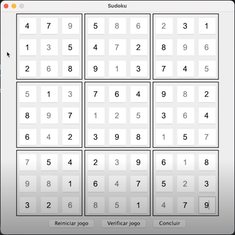

# 🧩 Sudoku Java - Swing Edition



> Um jogo clássico de Sudoku feito com Java e Swing.

## 🎯 Objetivo

Este projeto é uma implementação gráfica do jogo Sudoku, utilizando Java com a biblioteca Swing. Ele permite ao usuário resolver um quebra-cabeça Sudoku interativo diretamente no desktop.

## 📜 Regras do Sudoku

- O jogo consiste em uma grade 9x9 dividida em 9 subgrades 3x3.
- Cada linha, coluna e subgrade deve conter os números de **1 a 9**, sem repetição.

## ✨ Funcionalidades

- Interface gráfica amigável com Swing
- Validação de solução
- Reinício do jogo
- Possibilidade de concluir jogo e validar respostas
- Aceita argumentos externos para montar o tabuleiro inicial
- Visual profissional para portfólio

## 🚀 Como Executar

### ✅ Requisitos

- Java 11 ou superior
- IDE como IntelliJ, Eclipse ou execução via terminal

### ▶️ Executando pela IDE

1. Clone o repositório:
   ```bash
   git clone https://github.com/eliezermoraesss/sudoku-java-swing.git
   ```
2. Importe como projeto Maven ou Java padrão
3. Rode a classe `SudokuGame.java`

### 🖥️ Executando pelo Terminal

Compile:
```bash
javac -cp src src/SudokuGame.java -d bin
```

Execute com argumentos:
```bash
java -cp bin SudokuGame "0,0;4,false 1,0;7,false 2,0;9,true ..."
```

📌 **Obs:** Os argumentos devem seguir o padrão:

```
coluna,linha;valor,fixed
```

Exemplo:
```
2,0;9,true
```

Isso indica o número **9** na posição (linha 0, coluna 2), com valor fixo (não editável).

---

## 🧾 Argumentos de Exemplo

Você pode passar os seguintes argumentos na execução do projeto para carregar a grade inicial:

```
0,0;4,false 1,0;7,false 2,0;9,true 3,0;5,false 4,0;8,true 5,0;6,true 6,0;2,true 7,0;3,false 8,0;1,false
0,1;1,false 1,1;3,true 2,1;5,false 3,1;4,false 4,1;7,true 5,1;2,false 6,1;8,false 7,1;9,true 8,1;6,true
0,2;2,false 1,2;6,true 2,2;8,false 3,2;9,false 4,2;1,true 5,2;3,false 6,2;7,false 7,2;4,false 8,2;5,true
0,3;5,true 1,3;1,false 2,3;3,true 3,3;7,false 4,3;6,false 5,3;4,false 6,3;9,false 7,3;8,true 8,3;2,false
0,4;8,false 1,4;9,true 2,4;7,false 3,4;1,true 4,4;2,true 5,4;5,true 6,4;3,false 7,4;6,true 8,4;4,false
0,5;6,false 1,5;4,true 2,5;2,false 3,5;3,false 4,5;9,false 5,5;8,false 6,5;1,true 7,5;5,false 8,5;7,true
0,6;7,true 1,6;5,false 2,6;4,false 3,6;2,false 4,6;3,true 5,6;9,false 6,6;6,false 7,6;1,true 8,6;8,false
0,7;9,true 1,7;8,true 2,7;1,false 3,7;6,false 4,7;4,true 5,7;7,false 6,7;5,false 7,7;2,true 8,7;3,false
0,8;3,false 1,8;2,false 2,8;6,true 3,8;8,true 4,8;5,true 5,8;1,false 6,8;4,true 7,8;7,false 8,8;9,false
```

---

## 📁 Estrutura do Projeto

```
sudoku-java-swing/
├── img/
│   └── sudoku-solved.png
├── src/
│   ├── SudokuGame.java
│   ├── SudokuBoard.java
│   └── ... outros arquivos
└── README.md
```

---

## 👤 Autor

Desenvolvido com ❤️ por [Eliezer Moraes](https://www.linkedin.com/in/eliezer-moraes-silva-80b68010b/)

---

## 🧠 Sugestão

Use este projeto como um exemplo de como construir aplicações Java com Swing, ideal para entrevistas técnicas ou portfólio profissional.

---

## 🪄 Imagem do Jogo Resolvido

Abaixo, o estado final resolvido do Sudoku com os valores fixos e editáveis:


